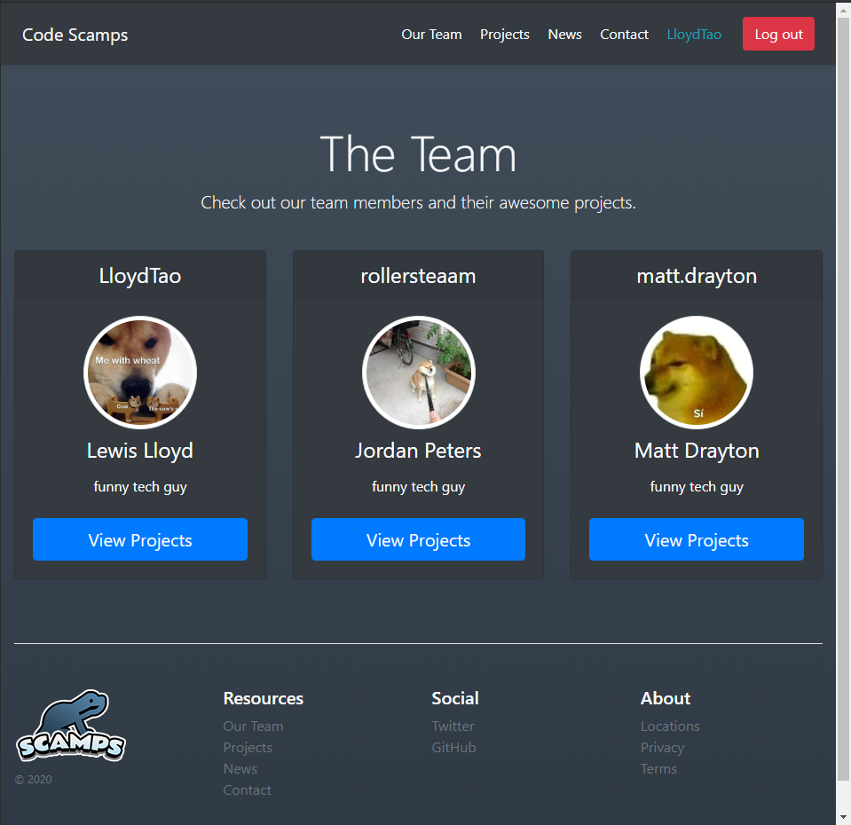

# Code Scamps

The Code Scamps website, made with ❤️ (and Django).



## Getting Started

These instructions will get you up and running on your local machine for development.

See **Deployment** for notes on how to deploy the project on a live system.

### Prerequisites

Python 3 (with pip):
```
https://www.python.org/downloads/
```

### Installing

Navigate to the repository and create a virtual environment:

```
$ python -m venv venv
```

Activate the virtual environment:

```
$ source venv/bin/activate		# Linux
$ source venv/Scripts/activate		# Windows
```

Install the required packages:

```
$ pip install -r requirements.txt
```

Run the server:

```
$ python manage.py runserver
```
You can now access the website at http://localhost:8000/.

## Testing

// TODO.

## Deployment

// TODO.

## Extras

### Built With

* [Django]([https://www.djangoproject.com/](https://www.djangoproject.com/)) - A Python web framework.
* [Bootstrap]([[https://getbootstrap.com/](https://getbootstrap.com/)](https://www.djangoproject.com/)) - For beautiful CSS.

### Authors

* **Lewis Lloyd** (GitHub: [LloydTao](https://github.com/LloydTao), Twitter: [LloydTao](https://twitter.com/LloydTao))

See also the list of [contributors](https://github.com/Code-Scamps/website/contributors) who participated in this project.

---

This project is licensed under the MIT License - see the [LICENSE.md](LICENSE.md) file for details.
